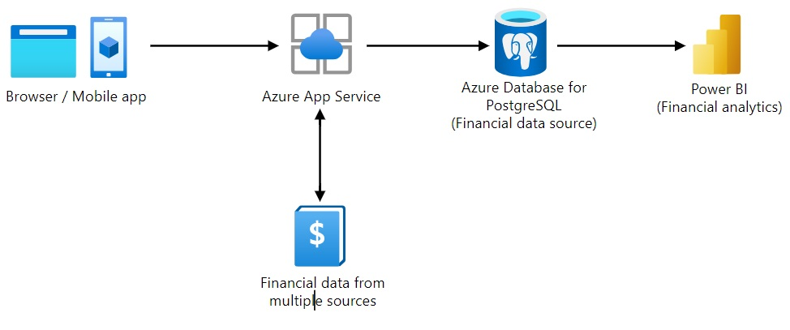

# Financial Data Analytics Application

This project details a Financial Data Analytics application deployed using Microsoft Azure services. The architecture incorporates various Azure components to enable real-time financial data analysis via a web or mobile interface.

## Architecture Diagram

## Components

1. **Browser / Mobile App**
    - The front-end user interface through which users can access the application.
    - Interactive and responsive UI for accessing financial insights.

2. **Azure App Service**
    - A fully managed platform for building, deploying, and scaling web apps.
    - Hosts the backend logic and handles requests from the Browser/Mobile app.
    - Interacts with the Azure Database for data operations.

3. **Azure Database for PostgreSQL**
    - A managed database service for app development and deployment.
    - Serves as the financial data source.
    - Stores data retrieved from various financial data sources.

4. **Power BI**
    - A suite of business analytics tools to analyze data and share insights.
    - Connects to the Azure Database for PostgreSQL to perform financial analytics.
    - Visualizes financial data through interactive reports and dashboards.

5. **Financial Data from Multiple Sources**
    - Various external financial data sources integrated into the system.
    - Feeds data into the Azure Database for PostgreSQL for further processing and analysis.

## Data Flow

1. Users interact with the application through the **Browser/Mobile App**.
2. The app sends requests to the **Azure App Service**.
3. The **Azure App Service** processes the requests and interacts with the **Azure Database for PostgreSQL** to retrieve or store financial data.
4. The **Azure Database for PostgreSQL** fetches data from multiple financial data sources and maintains it.
5. **Power BI** accesses the financial data stored in the **Azure Database for PostgreSQL** for analysis and generates analytical reports.
6. Users view the financial analytics through dashboards and reports created in **Power BI**.

## Benefits

- **Scalability**: Azure App Service allows easy scaling based on traffic and usage.
- **Managed Database**: Azure Database for PostgreSQL is a fully managed service ensuring data availability, disaster recovery, and security.
- **Advanced Analytics**: Power BI provides sophisticated tools for data visualization and business intelligence.
- **Flexibility**: Capability to integrate data from various financial data sources.
- **Accessibility**: Application accessible via web and mobile interfaces, increasing user engagement and accessibility.

## Conclusion

This architecture leverages the power of Azure services to provide a scalable, reliable, and secure solution for financial data analytics. Users can benefit from real-time data insights through an intuitive interface, making informed financial decisions.