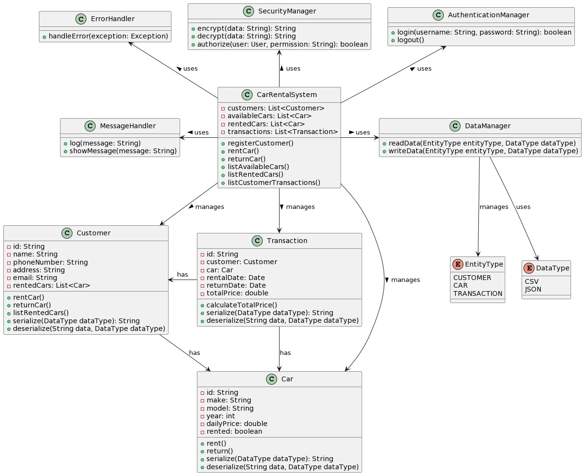

# Car Rental System

This repository contains the C# implementation of a Car Rental System designed based on the UML Class Diagram [CarRentalSystem.jpg](./CarRentalSystem.jpg). The design includes various classes such as `Customer`, `Car`, `Transaction`, `CarRentalSystem`, and more. Each class has been implemented with detailed methods and necessary attributes to facilitate a functional car rental system.

## Classes

### Class Diagram



### ErrorHandler

Handles errors and exceptions that occur in the system.

```csharp
using System;

public class ErrorHandler
{
    public void HandleError(Exception exception)
    {
        // Implementation for handling errors
        Console.WriteLine("Error: " + exception.Message);
    }
}
```

### SecurityManager

Handles encryption, decryption, and authorization related functions.

```csharp
using System;

public class SecurityManager
{
    public string Encrypt(string data)
    {
        // Implementation for encrypting data
        return Convert.ToBase64String(System.Text.Encoding.UTF8.GetBytes(data));
    }

    public string Decrypt(string data)
    {
        // Implementation for decrypting data
        return System.Text.Encoding.UTF8.GetString(Convert.FromBase64String(data));
    }

    public bool Authorize(string user, string permission)
    {
        // Implementation for authorizing the user with given permission
        // Here you can add your authorization logic
        return true;
    }
}
```

### AuthenticationManager

Handles user authentication (login and logout).

```csharp
public class AuthenticationManager
{
    public bool Login(string username, string password)
    {
        // Implementation for user login
        // Here you can add your login logic
        return true;
    }

    public void Logout()
    {
        // Implementation for user logout
        // Here you can add your logout logic
    }
}
```

### MessageHandler

Handles logging and displaying messages.

```csharp
public class MessageHandler
{
    public void Log(string message)
    {
        // Implementation for logging messages
        Console.WriteLine("Log: " + message);
    }

    public void ShowMessage(string message)
    {
        // Implementation for showing messages
        Console.WriteLine("Message: " + message);
    }
}
```

### DataManager

Handles reading and writing data.

```csharp
public enum EntityType
{
    CUSTOMER,
    CAR,
    TRANSACTION
}

public enum DataType
{
    CSV,
    JSON
}

public class DataManager
{
    public string ReadData(EntityType entityType, DataType dataType)
    {
        // Implementation for reading data based on entity type and data type
        return "ReadData";
    }

    public void WriteData(EntityType entityType, DataType dataType)
    {
        // Implementation for writing data based on entity type and data type
    }
}
```

### CarRentalSystem

Manages the core functionality of the car rental system.

```csharp
using System;
using System.Collections.Generic;

public class CarRentalSystem
{
    private List<Customer> customers = new List<Customer>();
    private List<Car> availableCars = new List<Car>();
    private List<Car> rentedCars = new List<Car>();
    private List<Transaction> transactions = new List<Transaction>();

    public void RegisterCustomer(Customer customer)
    {
        // Implementation for registering a customer
        customers.Add(customer);
    }

    public void RentCar(Customer customer, Car car)
    {
        // Implementation for renting a car
        if (availableCars.Contains(car))
        {
            availableCars.Remove(car);
            rentedCars.Add(car);
            customer.RentCar(car);
        }
    }

    public void ReturnCar(Customer customer, Car car)
    {
        // Implementation for returning a car
        if (rentedCars.Contains(car))
        {
            rentedCars.Remove(car);
            availableCars.Add(car);
            customer.ReturnCar(car);
        }
    }

    public List<Car> ListAvailableCars()
    {
        // Implementation for listing available cars
        return availableCars;
    }

    public List<Car> ListRentedCars()
    {
        // Implementation for listing rented cars
        return rentedCars;
    }

    public List<Transaction> ListCustomerTransactions(Customer customer)
    {
        // Implementation for listing customer's transactions
        return transactions.FindAll(t => t.Customer == customer);
    }
}
```

### Customer

Represents a customer with personal details and rented cars.

```csharp
using System;
using System.Collections.Generic;

public class Customer
{
    public string Id { get; set; }
    public string Name { get; set; }
    public string PhoneNumber { get; set; }
    public string Address { get; set; }
    public string Email { get; set; }
    public List<Car> RentedCars { get; private set; } = new List<Car>();

    public void RentCar(Car car)
    {
        // Implementation for renting a car
        RentedCars.Add(car);
    }

    public void ReturnCar(Car car)
    {
        // Implementation for returning a car
        RentedCars.Remove(car);
    }

    public List<Car> ListRentedCars()
    {
        // Implementation for listing rented cars
        return RentedCars;
    }

    public string Serialize(DataType dataType)
    {
        // Implementation for serializing customer data
        return "SerializedCustomerData";
    }

    public void Deserialize(string data, DataType dataType)
    {
        // Implementation for deserializing customer data
    }
}
```

### Transaction

Represents a rental transaction.

```csharp
using System;

public class Transaction
{
    public string Id { get; set; }
    public Customer Customer { get; set; }
    public Car Car { get; set; }
    public DateTime RentDate { get; set; }
    public DateTime ReturnDate { get; set; }
    public double TotalPrice { get; set; }

    public void CalculateTotalPrice()
    {
        // Implementation for calculating the total price
        TotalPrice = (ReturnDate - RentDate).TotalDays * Car.DailyPrice;
    }

    public string Serialize(DataType dataType)
    {
        // Implementation for serializing transaction data
        return "SerializedTransactionData";
    }

    public void Deserialize(string data, DataType dataType)
    {
        // Implementation for deserializing transaction data
    }
}
```

### Car

Represents a car with its properties.

```csharp
public class Car
{
    public string Id { get; set; }
    public string Make { get; set; }
    public string Model { get; set; }
    public int Year { get; set; }
    public double DailyPrice { get; set; }
    public bool Rented { get; set; }

    public void Rent()
    {
        // Implementation for renting the car
        Rented = true;
    }

    public void Return()
    {
        // Implementation for returning the car
        Rented = false;
    }

    public string Serialize(DataType dataType)
    {
        // Implementation for serializing car data
        return "SerializedCarData";
    }

    public void Deserialize(string data, DataType dataType)
    {
        // Implementation for deserializing car data
    }
}
```

### Enums

#### EntityType
Defines various entities in the system.

```csharp
public enum EntityType
{
    CUSTOMER,
    CAR,
    TRANSACTION
}
```

#### DataType
Specifies the data format.

```csharp
public enum DataType
{
    CSV,
    JSON
}
```

## Note:
To explore the above classes, methods, and their relationships, please refer to the class diagram provided in the repository [CarRentalSystem.jpg](./CarRentalSystem.jpg).